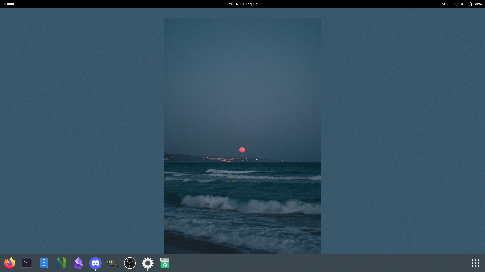

# Gnome dotfiles

# Screenshot

# Wallpapers
on wall folder

# Extensions
- [Dash to Dock](https://extensions.gnome.org/extension/307/dash-to-dock/)
- [Desktop Icons DING](https://extensions.gnome.org/extension/2087/desktop-icons-ng-ding/)
- [Tiling Assistant](https://extensions.gnome.org/extension/3733/tiling-assistant/)
- [Application Menu](https://extensions.gnome.org/extension/6/applications-menu/)
- [Places Status Indicator](https://extensions.gnome.org/extension/8/places-status-indicator/)
- [Removable Drive Menu](https://extensions.gnome.org/extension/7/removable-drive-menu/)
- [Tray Icons: Reloaded](https://extensions.gnome.org/extension/2890/tray-icons-reloaded/)

# Settings
- Remove animations
